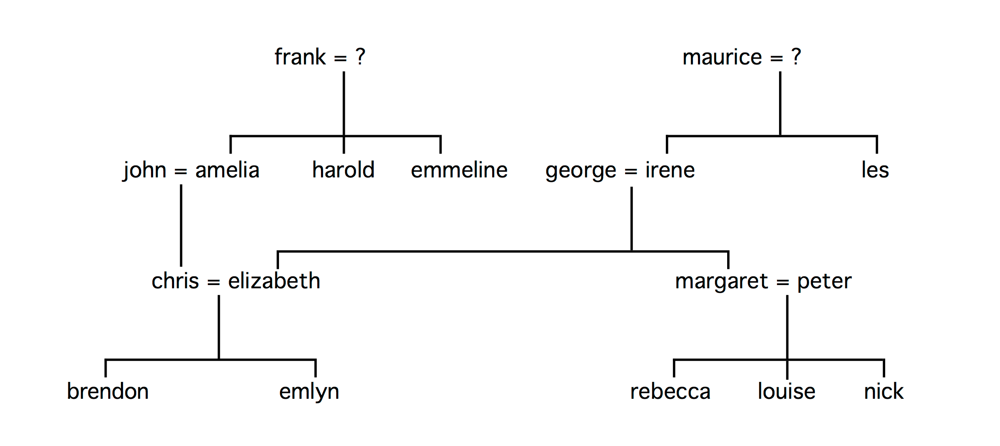

# Second programming worksheet on Logic Programming

The aim of these exercises is to familiarise you with simple Prolog programs and queries, and is based entirely 
upon a database representing this fragment of a family tree:



The database is just a set of atomic facts and will be already implemented so that you can use it straightaway. 
It uses just three predicates:
```
  child_of(X, Y) “X is a child of Y” 
  male(X) “X is male” 
  female(X) “X is female”
```
For instance, the first fact in the database is:
```
  child_of(emmeline, frank).
```
and expresses “emmeline is a child of frank”.

1. Enter the following queries and find all their solutions:  
  a) `?- child_of(peter, irene).`  
  b) `?- child_of(peter, emlyn).`  
  c) `?- child_of(X, george).`  
  d) `?- child_of(george, Y).`  
  e) `?- child_of(X, X).`  
  f) `?- child_of(X, Y).`
1. Add further Prolog clauses which define the following predicates:
    ```
    daughter_of(X, Y)     "X is a daughter of Y"
    uncle_of(X, Y)        "X is an uncle of Y"
    niece_of(X, Y)        "X is a niece of Y"
    grandfather_of(X, Y)  "X is a grandfather of Y"
    ```
daughter_of(X,Y) :- child_of(X, Y) , female(X).

uncle_of(Y, X) :- child_of(X, Z), child_of(Z, F),  child_of(Y,F) , Z\=Y, male(Y).

niece_of(X,Y) :- child_of(X, Z), child_of(Z, F),  child_of(Y,F) , Z\=Y, female(Y).

grandfather_of(Y, X) :- child_of(X, Z), child_of(Z, Y) , male(Y).

Test each one by posing suitable queries and finding all their solutions.
    
    As a guiding example, this is how we might define "X is a sister of Y":
    ```
    sister_of(X, Y) :- child_of(X, Z), child_of(Y, Z), X\==Y, female(X).
    ```
    Note that in Prolog, `\==` (backslash, equals, equals) means "not identical to".
